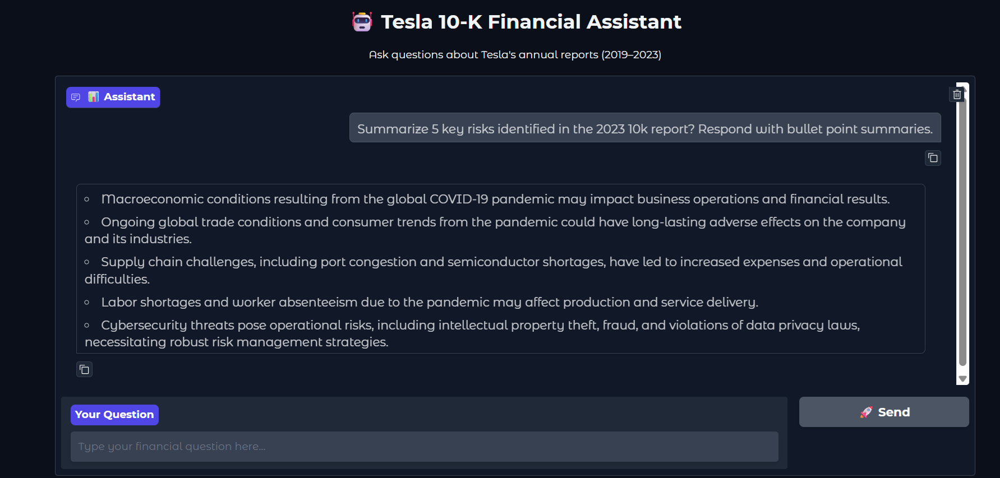

# Tesla RAG with ChromaDB

This project implements a Retrieval-Augmented Generation (RAG) system using ChromaDB and Azure OpenAI. It allows users to query Tesla financial documents interactively with an AI assistant.

---

## Features

- Embedding-based document retrieval using ChromaDB.
- Azure OpenAI GPT-4o-mini model for natural language understanding.
- Interactive Q&A system with context-aware responses.
- Local vector database storage for fast similarity search.

---

## Project Structure

- `rag-chat.py` — main script running the interactive assistant.
- `tesla_db/` — local persistent ChromaDB vector store (should be gitignored).
- `image/RAG_Tesla.png` — architecture and flow diagram.

---

## Usage

### 1. Install dependencies

```bash
pip install -r requirements.txt
